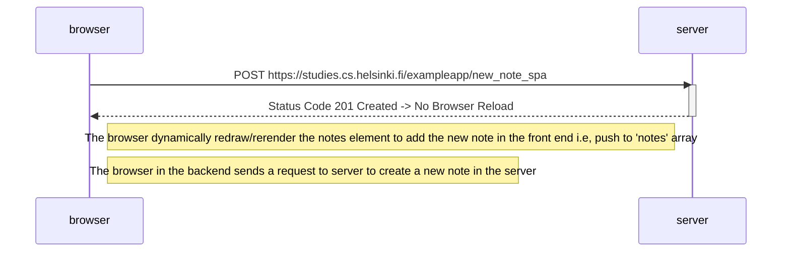

```mermaid
sequenceDiagram
    participant browser
    participant server

    browser->>server: POST https://studies.cs.helsinki.fi/exampleapp/new_note_spa
    activate server
    server-->>browser: Status Code 201 Created -> No Browser Reload
    deactivate server


    Note right of browser: The browser dynamically redraw/rerender the notes element to add the new note in the front end i.e, push to 'notes' array
    Note right of browser: The browser in the backend sends a request to server to create a new note in the server

```
